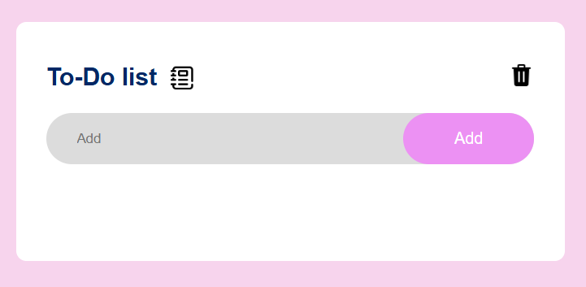
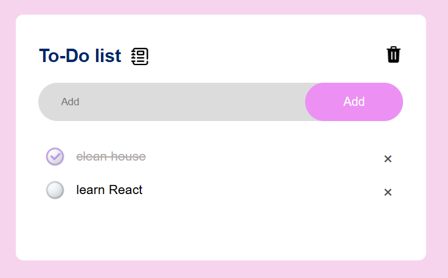

### To-Do List Project

This is a simple To-Do list web application that allows users to add, delete, and mark tasks as complete. The tasks are stored in the browser's local storage, so the list persists even after the page is refreshed.

## Features
- Add new tasks to the list.
- Mark tasks as completed by clicking on them.
- Delete tasks by clicking the delete (×) icon next to each task.
- Clear all tasks at once.
- Data is saved in local storage for persistence.

## Technologies Used
- HTML
- CSS
- JavaScript(Vanilla)

## Usage

1. Type a task in the input box and click the "Add" button to add it to the list.
2. Click on a task to mark it as completed.
3. Click the "×" icon to delete a task.
4. Click the "Clear" icon to remove all tasks.

## Data Persistence
To store the task list in the web browser, I used the capabilities of localStorage. This technology allows data to be stored on the client side, ensuring it remains available even after refreshing the page or closing the browser.

The task of saving and retrieving data was helped to be implemented by ChatGPT.

## Screenshots

## Author
* Oleksandra Friz

A software engineering student aspiring to become a front-end developer.